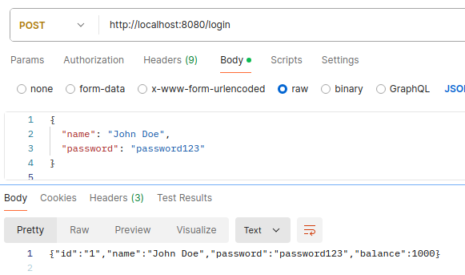
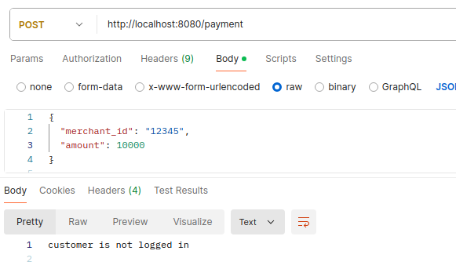
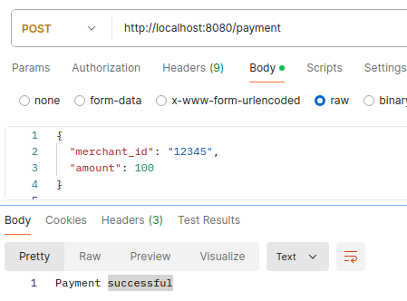

# Merchant-Bank API

Proyek ini adalah API sederhana yang mensimulasikan interaksi antara merchant dan bank.

## Fitur

- Login
- Pembayaran
- Logout

## Cara Menjalankan

1. Clone repositori:

   ```sh
   git clone https://github.com/tommy17002/API-merchant-n-bank
   cd merchant-bank-api
   ```

2. Jalankan aplikasi:

   ```sh
   go run main.go
   ```

3. API akan tersedia di `http://localhost:8080`.

## Endpoint API

- `POST /login`
- `POST /logout`
- `POST /payment`

## Pengujian

Untuk menjalankan tes pada postman :

#### Login terlebih dahulu:

- URL: POST http://localhost:8080/login

- Body (JSON):

{
"name": "John Doe",
"password": "password123"
}

#### Login sukses



#### Login gagal


#### Lakukan pembayaran:

- URL: POST http://localhost:8080/payment

- Body (JSON):

{
"merchant_id": "12345",
"amount": 100
}

#### Response yang diharapkan:

##### Jika belum login



##### Jika saldo mencukupi



##### Jika saldo tak mencukupi


##### Jika membayar jumlah 0 atau kurang dari 0


#### Logout


